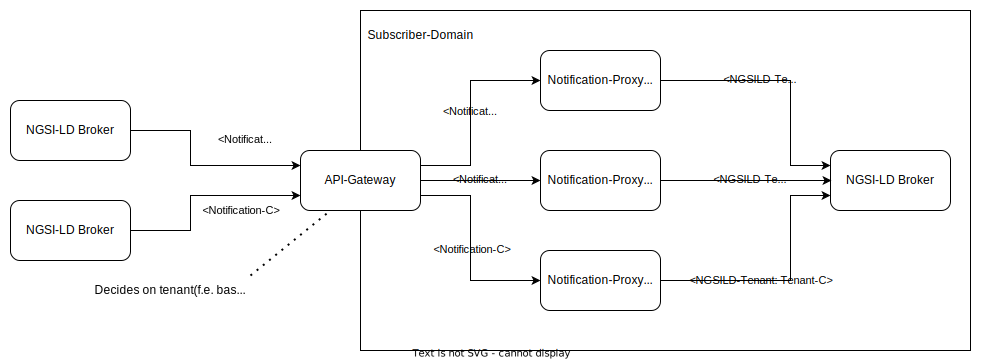

# <a name="top"></a>Notification-Proxy
[](https://opensource.org/licenses/AGPL-3.0)
[](https://quay.io/repository/wi_stefan/notification-proxy?tab=tags)
[](https://coveralls.io/github/wistefan/notification-proxy?branch=master)
[](https://github.com/wistefan/notification-proxy/actions/workflows/it.yaml)

In order to allow an  [NGSI-LD](https://docbox.etsi.org/isg/cim/open/Latest%20release%20NGSI-LD%20API%20for%20public%20comment.pdf) [broker](https://github.com/FIWARE/catalogue#core-context-broker-components) to receive 
data sent through subscriptions by another broker, the notification-proxy translates notifications into entity creation or update
requests at the NGSI-LD api. For every entity received in the [data-part of a notification](api/api.yaml#L299), the proxy first tries
a ```POST /entities/{entityId}/attrs/``` to update(and overwrite the properties) the entity. If ```404 - NOT FOUND``` is returned by the broker,
the proxy will try to create the entity via ```POST /entities```.

## Deployment

The notification-proxy is provided as a container: https://quay.io/repository/wi_stefan/notification-proxy
Run it via: ```docker run quay.io/wi_stefan/notification-proxy``` It will be available at port ```8080``` per default.
All configurations can be provided with the standard mechanisms of the [Micronaut-Framework](https://micronaut.io/), e.g. [environment variables or appliction.yaml file](https://docs.micronaut.io/3.1.3/guide/index.html#configurationProperties).
The following table concentrates on the most important configuration parameters:


| Property                    | Env-Var                     | Description                                       | Default                                                     |
|-----------------------------|-----------------------------|---------------------------------------------------|-------------------------------------------------------------|
| `micronaut.server.port`     | `MICRONAUT_SERVER_PORT`     | Server port to be used for the notfication proxy. | 8080                                                        |
| `micronaut.metrics.enabled` | `MICRONAUT_METRICS_ENABLED` | Enable the metrics gathering                      | true                                                        |
| `general.tenant`            | `GENERAL_TENANT`            | Tenant to be used when forwarding to orion        | null                                                        |
| `http.services.broker.url`  | `HTTP_SERVICES_BROKER_URL`  | Url of the broker to forward to.                  | http://localhost:1027                                       |

## Tenancy

The proxy does not extract any tenancy information out of the notifications. However the tenant to be used can be configured via ```GENERAL_TENANT=myTenant```. 
Thus, if the setup requires multi-tenancy, runnig multiple instances of the proxy with prefiltering of the requests would be the prefered solution.

The setup can look as following:

An API-Gateway handles all incoming traffic and forwards it based on the tenancy information present in the request(f.e. inside an ```Authorization-Header```). 

## Development & Testing

In order to support local development and testing, a [docker-compose](https://docs.docker.com/compose/) is provided at [env/docker-compose.yaml](env/docker-compose.yaml). Run it 
via ```docker-compose -f env/docker-compose.yaml up```. The setup contains two [Orion-LD Context Brokers](https://github.com/FIWARE/context.Orion-LD), one for sending the notifications to the 
notification-proxy and one for receiving the changes. The notification-proxy itself is not included and should be started separately. 
The setup provides following services on localhost:
* Orion-LD for receiving data: ```localhost:1027``` - this is the one that the proxy should be connected to
* Orion-LD for sending notifications: ```localhost:1026``` - orion-instance to create the subscription to the proxy

### Example usage:
* Run compose: ```docker-compose -f env/docker-compose.yaml up```
* Run notification-proxy: ```docker run --env HTTP_SERVICES_BROKER_URL=http://localhost:1027 -p 8080:8080 quay.io/wi_stefan/notification-proxy```
* Create a subscription:
```shell
    curl --location --request POST 'localhost:1026/ngsi-ld/v1/subscriptions/' \
        --header 'Content-Type: application/json' \
        --data-raw ' {
            "name": "mySubscription",
            "id": "urn:ngsi-ld:subscription:my-sub",
            "type": "Subscription",
            "entities": [
              {
                "type": "Cattle"
              }
            ],
            "notification": {
                "endpoint": {
                "uri": "http://localhost:8080/notification"
                }
            }
        }'
  ```
* Create an entity at the broker:
```shell
    curl --location --request POST 'localhost:1026/ngsi-ld/v1/entities' \
        --header 'Content-Type: application/json' \
        --data-raw '{
            "id": "urn:ngsi-ld:cattle:my-cattle",
            "type": "Cattle",
            "temp": {
                "type": "Property",
                "value": 37
            }
        }'
```
* Query receiving broker: ```curl --location --request GET 'localhost:1027/ngsi-ld/v1/entities/urn:ngsi-ld:cattle:my-cattle'``` - result:
```json
{
    "@context": "https://uri.etsi.org/ngsi-ld/v1/ngsi-ld-core-context.jsonld",
    "id": "urn:ngsi-ld:cattle:my-cattle",
    "type": "Cattle",
    "temp": {
        "type": "Property",
        "value": 37
    }
}
```
* Update a property: 
```shell
curl --location --request POST 'localhost:1026/ngsi-ld/v1/entities/urn:ngsi-ld:cattle:my-cattle/attrs' \
    --header 'Content-Type: application/json' \
    --data-raw '{
        "temp": {
            "type": "Property",
            "value": 40
        }
    }'
```
* Query receiving broker: ```curl --location --request GET 'localhost:1027/ngsi-ld/v1/entities/urn:ngsi-ld:cattle:my-cattle'``` - result:
```json
{
    "@context": "https://uri.etsi.org/ngsi-ld/v1/ngsi-ld-core-context.jsonld",
    "id": "urn:ngsi-ld:cattle:my-cattle",
    "type": "Cattle",
    "temp": {
        "type": "Property",
        "value": 40
    }
}